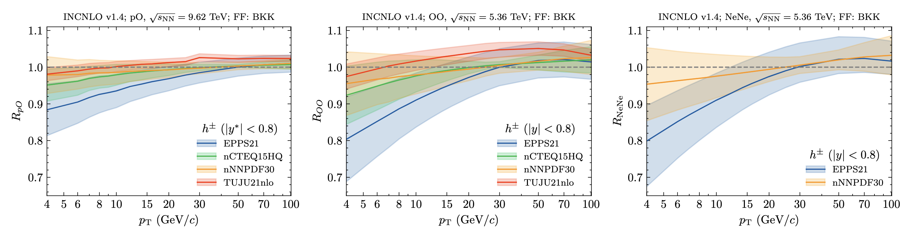

# pQCDLightIon



This repository contains perturbative QCD calculations for light-ion collisions used in the paper:

> **A compendium of cold-nuclear matter baseline predictions in light-ion collisions**  
> Florian Jonas, Constantin Loizides, Aleksas Mazeliauskas, Petja Paakkinen, Nicolas Strangmann  
> arXiv:2602.15928 [hep-ph]

## Citation

If you use this data, please cite:

```bibtex
@article{Jonas:2026yoz,
    author = "Jonas, Florian and Loizides, Constantin and Mazeliauskas, Aleksas and Paakkinen, Petja and Strangmann, Nicolas",
    title = "{A compendium of cold-nuclear matter baseline predictions in light-ion collisions}",
    eprint = "2602.15928",
    archivePrefix = "arXiv",
    primaryClass = "hep-ph",
    month = "2",
    year = "2026"
}
```

## Data Organization

This repository contains theoretical predictions for hadron, photon, and electroweak boson production in light-ion collisions using three calculation frameworks:

### 1. JETPHOX Calculations ([`jetphox/`](./jetphox/))

Direct photon production calculations including:

- **Observables**: Nuclear modification factors (R_pO, R_OO)
- **Collision energies**: 5.36 TeV, 9.62 TeV
- **Nuclear PDF sets**: 
  - EPPS21
  - nCTEQ15HQ
  - nNNPDF30
  - TUJU21

**File naming convention**: `PromptPhoton_{Observable}_{nPDF}_{Energy}GeV.txt`

**Example files**:
- `PromptPhoton_RpO_EPPS21nlo_9620GeV.txt` - proton-oxygen nuclear modification factor
- `PromptPhoton_ROO_TUJU21_5360GeV.txt` - oxygen-oxygen nuclear modification factor

---

### 2. INCNLO Calculations ([`incnlo/`](./incnlo/))

Hadron production calculations organized into three categories:

#### 2.1 Nuclear Modification Factors ([`incnlo/nuclearmodfactor/`](./incnlo/nuclearmodfactor/))

Nuclear modification factors for π⁰ and charged hadrons:

- **Observables**: R_pO (proton-nucleus), R_OO (nucleus-nucleus)
- **Particle types**: π⁰ (`pi0`), charged hadrons (`chhadron`)
- **Collision energies**: 5.36 TeV, 9.62 TeV
- **Fragmentation function**: BKK

**File naming convention**: `incnlo_{particle}_{Observable}_{pPDF}_{nPDF}_{FF}_{Energy}GeV.txt`

**Example files**:
- `incnlo_pi0_RpO_CT18ANLO_EPPS21nlo_CT18Anlo_O16_BKK_9620GeV.txt`
- `incnlo_chhadron_ROO_EPPS21nlo_CT18Anlo_O16_CT18ANLO_BKK_5360GeV.txt`

#### 2.2 Cross-Section Energy Ratios ([`incnlo/cme_ratios/`](./incnlo/cme_ratios/))

Ratios of production cross-sections at different collision energies:

- **Particle types**: π⁰, charged hadrons
- **Energy ratios**: 
  - 5.36 TeV / 9.62 TeV
  - 7.00 TeV / 9.62 TeV
  - 8.00 TeV / 9.62 TeV
  - 13.0 TeV / 9.62 TeV
  - 13.6 TeV / 9.62 TeV
- **PDF set**: CT18ANLO
- **Fragmentation function**: BKK

**File naming convention**: `incnlo_{particle}_CrossSectionRatio_{PDF}_{PDF}_{FF}_{E1}over{E2}GeV.txt`

**Example files**:
- `incnlo_pi0_CrossSectionRatio_CT18ANLO_CT18ANLO_BKK_13600over9620GeV.txt`
- `incnlo_chhadron_CrossSectionRatio_CT18ANLO_CT18ANLO_BKK_5360over9620GeV.txt`

#### 2.3 Derived Ratios ([`incnlo/derivedratios/`](./incnlo/derivedratios/))

Additional derived quantities from the INCNLO nuclear modification factors.

---

### 3. MCFM Calculations ([`mcfm/`](./mcfm/))

Electroweak boson production calculations (W±, Z) and corresponding derived hadron-to-boson ratios:

#### 3.1 Nuclear Modification Factors ([`mcfm/nuclearmodfactor/`](./mcfm/nuclearmodfactor/))

Nuclear modification factors for W and Z bosons:

- **Observables**: R_pO (proton–oxygen), R_OO (oxygen–oxygen)
- **Boson types**: Z, W⁺, W⁻
- **Kinematic selections**: total fiducial yields (`total_fid`), rapidity-differential distributions (`y_dep`)
- **Nuclear PDF sets**:
  - EPPS21
  - nCTEQ15HQ
  - nNNPDF30
  - TUJU21

**File naming convention**: `[{Boson}]_{Observable}_{selection}_{nPDF}.txt`

**Example files**:
- `ZBoson_RpO_total_fid_nCTEQ15HQ.txt`
- `WMinusBoson_ROO_total_fid_nNNPDF30.txt`
- `ZBoson_RpO_y_dep_nNNPDF30.txt`
- `WPlusBoson_ROO_total_fid_nNNPDF30.txt`

#### 3.2 Derived Ratios ([`mcfm/derivedratios/`](./mcfm/derivedratios/))

Ratios of INCNLO hadron production to MCFM Z-boson production:

- **Observable**: hadron-over-Z ratio as a function of hadron \(p_T\)
- **Nuclear PDF sets**:
  - EPPS21
  - nCTEQ15HQ
  - nNNPDF30
  - TUJU21

**File naming convention**: `HadronOverZ_{nPDF}.txt`

**Example files**:
- `HadronOverZ_EPPS21.txt`
- `HadronOverZ_nCTEQ15HQ.txt`

---

## Data Format

All data files follow a common tabular format:

```
pt    [observable]    error
7.0   0.9395         0.0220
9.0   0.9518         0.0199
...
```

Where:
- `pt` = transverse momentum (GeV/c)
- `[observable]` = R_pO, R_OO, or cross-section ratio value
- `error` = uncertainty on the observable (either scale or nPDF)

---


## Contact

For questions about this data, please contact Florian Jonas (florian.jonas@cern.ch) or open an issue.